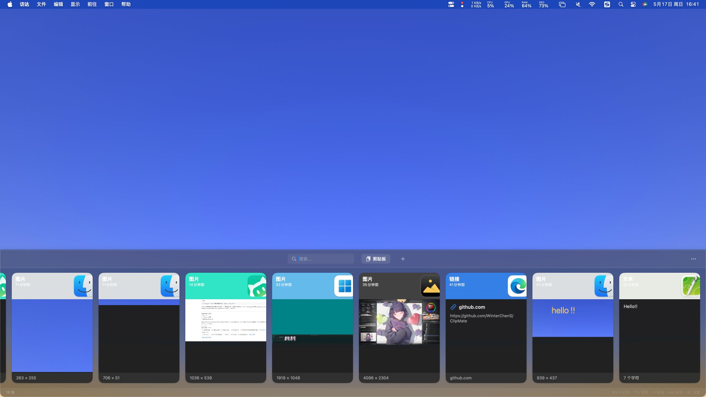

# ClipMate - macOS 剪贴板管理器

高保真复刻 macOS Paste 应用，使用纯原生 Swift 6 + SwiftUI/AppKit 开发。



> ✅ **无需 Xcode！** 使用 `swift build` + `build.sh` 直接编译打包，支持 Apple Silicon 和 Intel Mac。

## 功能特性

| 模块 | 功能 | 状态 |
|------|------|------|
| 📋 剪贴板监听 | 实时监听，支持文本/图片/文件/链接/富文本 | ✅ |
| 📜 历史面板 | 横向滑动卡片列表，高保真 Paste UI，主色提取 | ✅ |
| 🔍 全文搜索 | FTS5 全文索引，300ms 防抖实时搜索 | ✅ |
| 📌 Pinboard | 固定板分组管理，颜色标签，右键删除/重命名 | ✅ |
| ⭐ 收藏夹 | 收藏重要剪贴板条目 | ✅ |
| ⌨️ 全局快捷键 | ⌘⇧V 呼出面板（Carbon RegisterEventHotKey） | ✅ |
| 🚫 应用排除 | 排除密码管理器等敏感应用 | ✅ |
| ⚙️ 偏好设置 | 开机自启/Dock 图标/通知/存储管理/导出数据 | ✅ |
| ☁️ iCloud 同步 | iCloud Drive ubiquity 容器同步（需 Xcode 签名） | ✅ |
| 🔐 辅助功能检测 | 权限丢失自动提示，覆盖安装引导重授权 | ✅ |
| 🎨 应用图标 | 菜单栏 + Dock 图标，icns 全尺寸 | ✅ |

## 编译运行

### 方式一：build.sh 一键构建（推荐）

```bash
cd PasteClone

# Universal Binary（默认，同时支持 M 系列 + Intel Mac）
./build.sh

# 仅 Apple Silicon
./build.sh --arch arm64

# 仅 Intel Mac
./build.sh --arch x86_64
```

构建产物在 `.build/` 目录下：

| 产物 | 说明 |
|------|------|
| `ClipMate-1.0.0-Universal.dmg` | 双架构通用（默认） |
| `ClipMate-1.0.0-ARM.dmg` | 仅 Apple Silicon |
| `ClipMate-1.0.0-Intel.dmg` | 仅 Intel Mac |

**子命令**：

```bash
./build.sh build       # 仅编译
./build.sh bundle      # 编译 + 打 .app + 签名
./build.sh dmg         # 全流程（默认）
./build.sh run         # 编译并运行
./build.sh clean       # 清理构建产物
```

### 方式二：手动编译

```bash
# Release 编译
swift build -c release

# 运行
.build/release/ClipMate
```

### 方式三：Xcode（需要 Xcode + 开发者账号）

```bash
open PasteClone.xcodeproj
# ⌘R 运行
```

> ⚠️ iCloud 同步功能需要通过 Xcode 构建并配合有效的 Provisioning Profile，`build.sh` 构建的版本会自动移除 iCloud entitlements 以避免启动失败。

## 依赖说明

| 库 | 版本 | 用途 |
|----|------|------|
| [GRDB.swift](https://github.com/groue/GRDB.swift) | 6.29 | SQLite ORM + FTS5 全文搜索 |

## 技术要点

- **剪贴板监听**: `NSPasteboard.changeCount` 轮询方案（0.5s 间隔），排除规则支持
- **UI**: `NSPanel` HUD 磨砂透明背景 + SwiftUI 横向卡片画廊
- **数据**: GRDB + FTS5 全文索引，存储于 `~/Library/Application Support/ClipMate/`
- **全局快捷键**: Carbon `RegisterEventHotKey` API（⌘⇧V），LSUIElement 模式
- **多架构**: `swift build --arch` + `lipo -create` 生成 Universal Binary
- **签名**: PlistBuddy 过滤 iCloud entitlements 后 codesign，避免 error 153
- **Swift 6**: 全面使用 `@MainActor` 确保并发安全，strict concurrency 模式

## macOS 版本要求

- **最低**: macOS 14.0 (Sonoma)
- **推荐**: macOS 15.0 (Sequoia)

## 授权提示

首次运行时需要在 **系统设置 > 隐私与安全性 > 辅助功能** 中授权，否则快速粘贴功能无法工作。覆盖安装后需先删除旧条目再重新添加。

## License

MIT License
